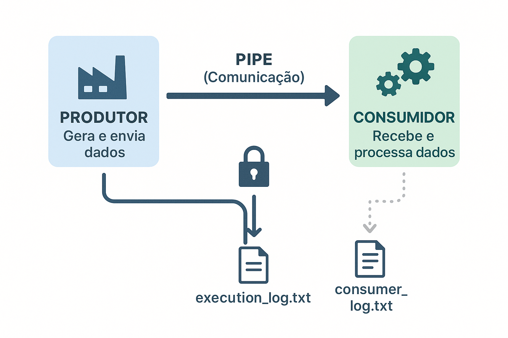

# Desafio 01: Comunicação entre Processos (IPC)

* **Aluna:** Nathalia Ohana Barigchum Leite
* **Instituição:** Centro Universitário SENAI CIMATEC
* **Disciplina:** Sistemas Distribuídos & Programação Paralela
* **Professor:** Edson Mota da Cruz
* **Data de Entrega:** 20/08/2025

---

## 1. Descrição do Projeto

Este projeto implementa um sistema **Produtor-Consumidor** utilizando comunicação entre processos (IPC) em Python. O objetivo é demonstrar a troca de dados contínua e a sincronização entre dois processos independentes.

O sistema é composto por dois processos independentes:

- **Produtor:** Gera dados variáveis (números inteiros aleatórios) e os envia para o Consumidor

- **Consumidor:** Recebe os dados, os processa (verificando se são pares ou ímpares) e registra o resultado em um arquivo de log específico.                                        

O projeto demonstra a criação e gerenciamento de processos, a troca de dados contínua e a sincronização para acesso a recursos compartilhados (o arquivo de log de execução).

---
## 2. Atendimento aos Requisitos Obrigatórios

Abaixo está detalhado como cada um dos requisitos obrigatórios da atividade  **Desafio 01** foi implementado.

* **1. Criar dois processos independentes (produtor e consumidor).**
    * **Implementação:** O script utiliza a biblioteca `multiprocessing` para criar duas instâncias de `Process`, uma para a função `produtor` e outra para a `consumidor`. Elas são iniciadas com `.start()` e executam de forma independente.

* **2. Realizar no mínimo 10 envios/recebimentos de dados.** 
    * **Implementação:** A função `produtor` contém um laço `for i in range(12):` que garante a realização de 12 envios, superando o mínimo de 10 solicitado.

* **3. Os dados enviados devem ser variáveis, não repetitivos.**
    * **Implementação:** A cada iteração do laço, o produtor gera um novo dado com a linha `dado = random.randint(1, 100)`, garantindo que os valores enviados sejam sempre aleatórios e não repetitivos.

* **4. O consumidor deve processar os dados recebidos e registrar a saída em log ou arquivo.** 
    * **Implementação:** Ao receber um dado, o consumidor o processa com a lógica `resultado = "Par" if dado % 2 == 0 else "Impar"`. Em seguida, ele formata uma mensagem e a registra no arquivo `consumer_log.txt`, incluindo um timestamp.

* **5. Tratar erros e situações de bloqueio.** 
    * **Implementação:**
        * **Bloqueio:** A situação de bloqueio é tratada pelo método `pipe_conn.recv()` no consumidor, que pausa a execução do processo de forma segura até que um dado seja enviado pelo produtor.
        * **Erros:** O código utiliza blocos `try...except` para tratar falhas. O `produtor` captura `BrokenPipeError` (caso o consumidor feche a conexão inesperadamente) e o `consumidor` captura `EOFError` (caso o produtor encerre sem enviar o sinal de término).

---

## 3. Mecanismo Escolhido: `Pipe` e `Lock`

Para a comunicação, foi escolhido o `multiprocessing.Pipe`, que estabelece um canal de comunicação simples e eficiente, ideal para o cenário de um produtor e um consumidor. 

Para a sincronização, foi usado um `multiprocessing.Lock` para garantir que a escrita no arquivo `execution_log.txt` ocorra sem conflitos, tratando uma situação de concorrência.


### Fluxo de Comunicação e Sincronização

O diagrama abaixo ilustra o fluxo de comunicação do sistema de forma simplificada e visual.




---


## 4. Como Executar o Projeto

1.  **Pré-requisitos:** 
    * Ter o Python 3 instalado. Nenhuma biblioteca externa é necessária.

2.  **Execução:**
    * Clone ou baixe este repositório.
    * Abra um terminal na pasta do projeto.
    * Execute o script principal com o comando:
        ```bash
        python ipc_desafio.py
        ```


---
## 5. Artefatos Gerados

A execução do script gera os seguintes arquivos de log:

* `consumer_log.txt`: Um log específico do `Consumidor`, contendo os dados recebidos e o resultado do seu processamento.


    


* `execution_log.txt`: Um log central e sincronizado que captura todas as ações e mensagens dos processos `Main`, `Produtor` e `Consumidor`.


    
